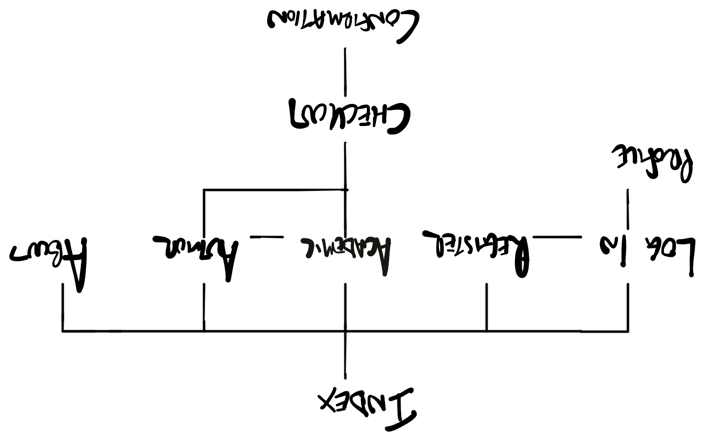
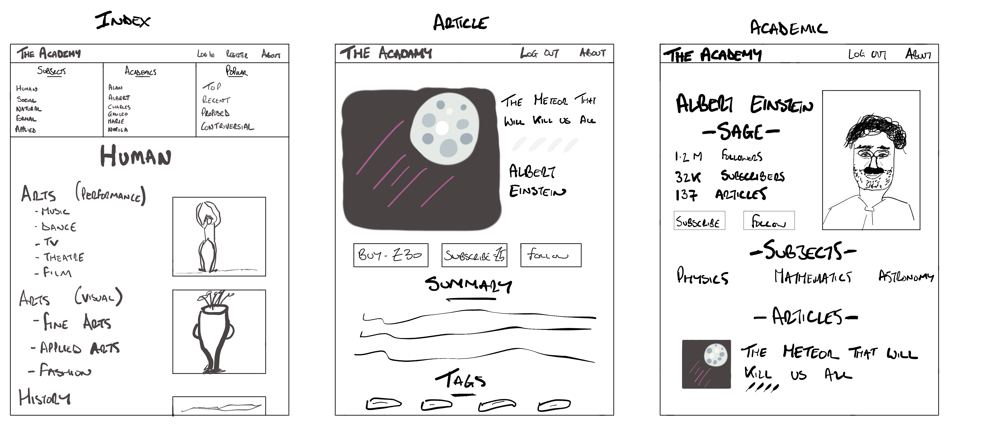
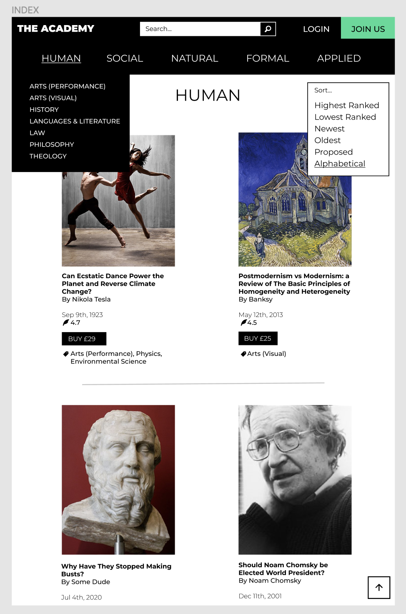
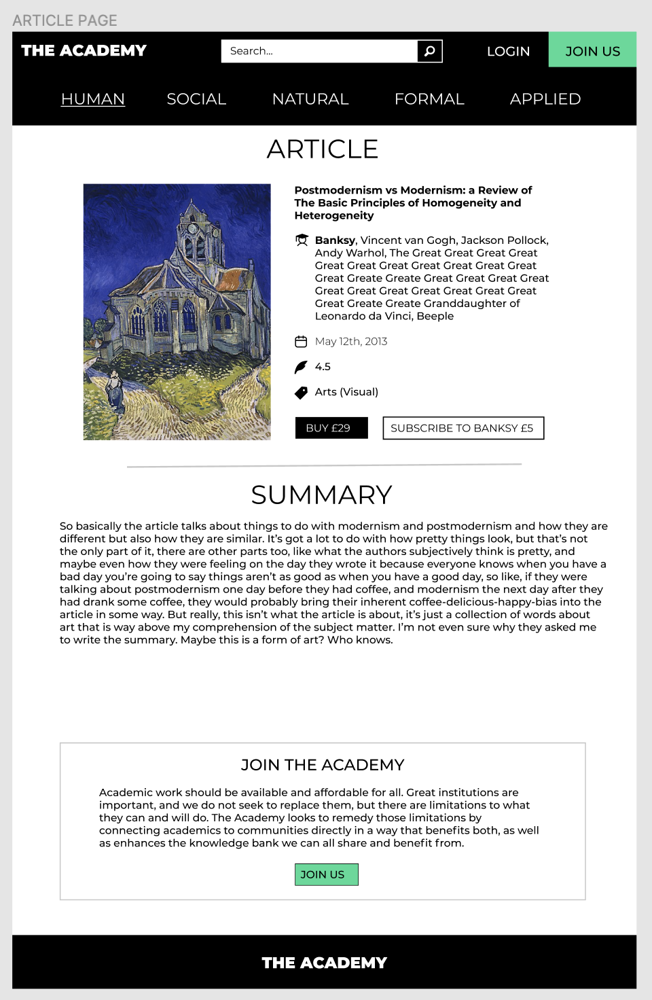
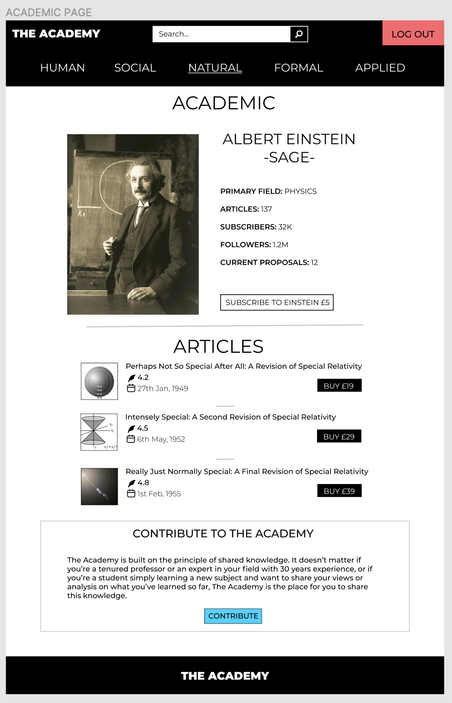
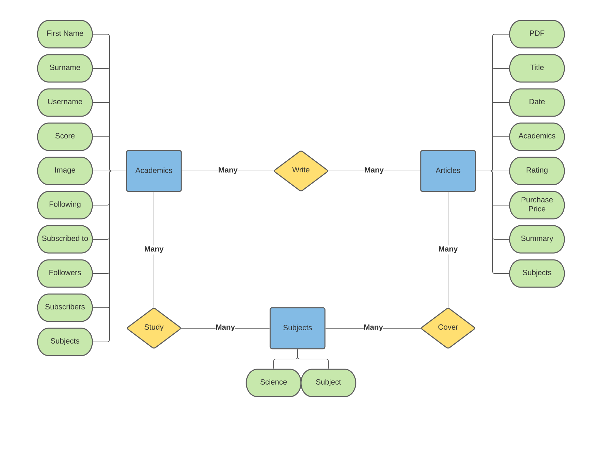
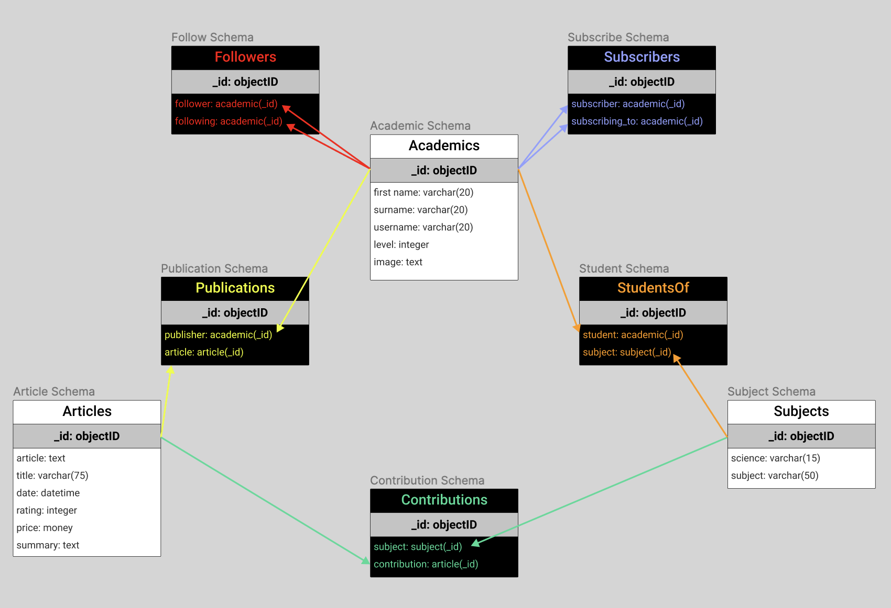

# 
The Academy

View the live site [here](https://trdownie.github.io/the-academy/)

This responsive website is an academic site that allows for the direct interaction of academics and the public. The purpose of this site is to connect officially recognsied academics who hold degrees and other experts with members of the public via a subscription service whereby the public fund and receive access to the work of the academics. This website also forms part of my diploma in Full Stack Development with the Code Institute, specifically full stack development. As such, this site has been developed using HTML5, CSS3, JavaScript & Python, built using the Django framework.

I have streamlined certain elements of my README process to avoid duplication of content and to ensure the bulk of the time is spent on development. No material information is lost, but instead concision is practiced where possible.

---
# 
PART I: PRE-DEVELOPMENT

The first section of this README details the pre-development process. The contents of this section are summarised below.

1. [Frontend Design: User Experience (UX)](#frontend-design)
    - [User Stories](#user-stories)
	- [Design](#design)
	- [Frameworks/Libraries](#frontend-tools)

2. [Backend Design](#backend-design)
    - [Database](#database)
    - [Frameworks & Libraries](#backend-tools)
---

## 
1. Frontend Design: User Experience (UX)

### 
- User Stories -

The **primary users** of this site will fall into two categories: students and teachers. These are both simply called academics, since academic learning never ends for true academics. The teacher/student distinction is only implied by way of whether these academics are producing (teachers) or consuming (students) academic work. Therefore, once a student writes a submission they are a teacher, and when a teacher consumes academic work of another they are a student.

### 
- Design -

#### *Strategy*

The **strategy** of the website aligns with the user goals above.

The **primary goal** of this website is to facilitate a direct connection between academics, namely students and teachers, through which the former can compensate the latter for direct access to their work.

The **secondary goal** of this website is to take a small cut of that income for the site owner, for the upkeep of the platform.

#### *Scope*

The scope of the website is to achieve the strategic goals outlined above.

The main scope considerations are:

- The landing page will display an intuitive navigation for users to find academic work
- The landing page will also be home to the main index with all of the latest submissions front and center
- Users will be able to view work by:
    - Subject
    - Teacher
    - Rating
    - Latest work
    - Tag (if time allows)
- There will be functionality for academics to:
	- Register an account
	- Log in & out
	- View/update their profile
	- Submit work for consumption or staking
	- Subscribe/purchase/stake other work

(Note: staking is paying a nominal amount to contribute to work before it is created, essentially funding the work via the platform)

The content considerations are:
- The index will contain the author, title, snippet, and a user-submitted graphic
- The article page will show the author's image, the full article graphic, the summary text and any further pertinent details
- User profiles will show the academic's other work and interests alongside a profile picture
- One bought, subscribed or staked, Articles will open in a pdf in a new tab

#### *Structure*

The structure of the website will revolve around the main index and user profiles.

The **website structure** will be as follows:

1. Landing Page (main index)
2. Register Page
3. Login Page
4. Profile Pages
5. Article Page
6. Academic Page
7. Checkout Page
8. Confirmation Page
9. About Page

A rough visual representation of this is below in the sitemap:

**Information flow** for the website is relatively straightforward. The main index is the centrepiece showcasing the articles. From here users can navigate to article pages and academic pages, then to checkout and confirmation when making purchases/subscriptions/stakes. Users can also register/log in to their profiles and view the about page with information regarding the site.

**Navigation** for the website will include a narrow top bar with links to register, log in and about. Underneath this, there will be a wider menu split into three main parts: subject, academic, and popular. Each of these will contain further links that will sort the index accordingly.

**Interaction** involves CRUD (for user profiles and articles), rating articles, sorting/filtering the articles, and searching the articles.

#### *Skeleton*

Initial sketches on paper led to the following (very) basic wireframes being developed using Concept App on an iPad Pro.

As you can see, the layout is simple and consistent on each page. A breakdown of the proposed **features** are as follows:

1. Index
	 - Ability to sort and filter by various dropdown menus
	 - Ability to search by subject, title or author
	 - Shopping cart feature for adding articles/subscriptions/stakes (once logged in)
2. Register Page
    - Page to register account
3. Login Page
	- Page to log into account
4. Profile Pages
	- Backend profile where academics can update their profile, settings and add articles
	- Form pages associated with specific elements here
5. Article Page
	- More information regarding article
	- Option to subscribe to author (if logged in)
	- Option to buy article (if completed) or stake article (if proposed)
6. Academic Page
	- Profile of academic with image and info
	- Option to subscribe to academic
	- List of published articles
	- List of people the academic subscribes to
7. Checkout Page
	- Upon any purchase, subscription or stake, showing summary
	- Stripe connection to take payment
8. Confirmation Page
	- Post check-out confirmation of purchase/subscription/stake
9. About Page
	- Information regarding the site and how it works

#### *Surface*

Following the wireframes, the final step of design was to create in-depth [mockups](https://www.figma.com/file/13wuXz0bu5UVPzeouO5ymU/The-Academy). Due to time constraints, only the index, article, and academic pages were created. They were created using Figma, and screenshots of these are below.

Regarding **typography**, a classically clean font, [Montserrat](https://fonts.google.com/specimen/Montserrat#about), was chosen. This is an extremely readable font and often recommended for cleanness, and therefore fitting for the clean, fresh design of the site. Montserrat has a full breadth of weights and italics within each weight, therefore allowing distinction. In addition, capitals are used for contrast.

The **colour scheme** employed is a combination of blac and white, with a collection of appealing accent colours. The back and white are used with a view to making the website appear classic, timeless, and therefore established. In contrast, the accent colours are used to bring a fresh vibe to its design that tells users this is not a tired and old establishment.

**Imagery** is used here in three instances: the article images, which the site encourages academics to upload; academic profiles, for adding personalisation; and icons, utilising the metaphorical nature of the human mind.

The **copy** used is relatively minimalistic, with the exception of the About page and tailored navigation boxes at the bottom, which explain the purpose of the site and how to use it, and try to draw users in deeper. The rest of the copy is almost exclusively entered by users in the form of articles and academic information, with the exception of bog standard directional microcopy.

### 
- Frameworks & Libraries -

#### *Frameworks*

No frontend frameworks will be used in this project.

#### *Libraries*

The following frontend libraries will be utilised:
- [Foundation by Zurb](https://get.foundation)
	- Used for style & layout
- [JQuery](https://jquery.com)
	- Used for animation and to support Foundation animations
- [Font Awesome](https://fontawesome.com)
	- Used for icons
- [Google Fonts](https://fonts.google.com)
	- Used to import Montserrat font

---

## 
2. Backend Design: Database and Frameworks

### 
- Database -

#### *Conceptual*

Initially, a simple Entity Relational (ER) data model was developed, as shown below.

Here, the blue squares represent the three main entities: academics, articles, and subjects. The yellow diamonds represent the relationships between the entities, with the relational verb within the diamond and the cardinality labelled on the lines that connect each entity pair. Finally, the green ovals represent the attributes of each entity.

However, each of the relationships are many-to-many. One academic can write many articles or study many subjects, one subjects can be studied by many academics or covered by many articles, and one article can cover many subjects or be written by many academics. In addition, there are many to many relationships between academics in two forms: subscribing and following. Therefore, in total, there are five many to many relationships. As such, five junction entities will be required in the next phase of database design: logical.

#### *Logical*

Next, a database schema was developed that shows the additional junction tables, how foreign keys will link each table, and the data types for each attribute.

As you can see, the model is more complex in regards to having more entities (tables), but the attributes within each table have been significantly simplified.

### *Physical*

Finally, consideration must be given to the physical DBMS that will be used in production. Since Django will be utilised, and since this is still a relatively simple database structure, I will default to SQLite, the default Django database that is built into Python. This is a relational database, therefore the schemas above will work nicely.

### 
- Frameworks & Libraries -

#### *Frameworks*

The [Django framework](https://www.djangoproject.com) will be used for backend development. The development section is broken down into reusable components, with an app built for each component, in line with Django development.

#### *Libraries*

No backend libraries will be used.

