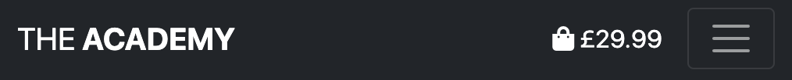

# <div align="center">The Academy</div>

View the live site [here](https://trdownie.github.io/the-academy/)

This responsive website is an academic site that allows for the direct interaction of academics and the public. The purpose of this site is to connect officially recognsied academics who hold degrees and other experts with members of the public via a subscription service whereby the public fund and receive access to the work of the academics. This website also forms part of my diploma in Full Stack Development with the Code Institute, specifically full stack development. As such, this site has been developed using HTML5, CSS3, JavaScript & Python, built using the Django framework.

I have streamlined certain elements of my README process to avoid duplication of content and to ensure the bulk of the time is spent on development. No material information is lost, but instead concision is practiced where possible.

<div align="center"></div>

Jump to section:

[PART I: PRE-DEVELOPMENT](#part-i)
[PART II: DEVELOPMENT](#part-ii)
[PART III: POST-DEVELOPMENT](#part-iii)

---
# <div align="center" id="part-i">PART I: PRE-DEVELOPMENT</div>

The first section of this README details the pre-development process. The contents of this section are summarised below.

1. [Frontend Design: User Experience (UX)](#frontend-design)
    - [User Stories](#user-stories)
	- [Design](#design)
	- [Frameworks/Libraries](#frontend-tools)
2. [Backend Design](#backend-design)
    - [Database](#database)
    - [Frameworks & Libraries](#backend-tools)
---

## <div align="center" id="frontend-design">1. Frontend Design: User Experience (UX)</div>

### <div align="center" id="user-stories">- User Stories -</div>

The **primary users** of this site will fall into two categories: students and teachers. These are both simply called academics, since academic learning never ends for true academics. The teacher/student distinction is only implied by way of whether these academics are producing (teachers) or consuming (students) academic work. Therefore, once a student writes a submission they are a teacher, and when a teacher consumes academic work of another they are a student.

<div align="center"></div>

### <div align="center" id="design">- Design -</div>

#### ***Strategy***

The **strategy** of the website aligns with the user goals above.

The **primary goal** of this website is to facilitate a direct connection between academics, namely students and teachers, through which the former can compensate the latter for direct access to their work.

The **secondary goal** of this website is to take a small cut of that income for the site owner, for the upkeep of the platform.

#### ***Scope***

The scope of the website is to achieve the strategic goals outlined above.

The main scope considerations are:

- The landing page will display an intuitive navigation for users to find academic work
- The landing page will also be home to the main index with all of the latest submissions front and center
- Users will be able to view work by:
    - Subject
    - Teacher
    - Rating
    - Latest work
    - Tag (if time allows)
- There will be functionality for academics to:
	- Register an account
	- Log in & out
	- View/update their profile
	- Submit work for consumption or staking
	- Subscribe/purchase/stake other work

(Note: staking is paying a nominal amount to contribute to work before it is created, essentially funding the work via the platform)

The content considerations are:
- The index will contain the author, title, snippet, and a user-submitted graphic
- The article page will show the author's image, the full article graphic, the summary text and any further pertinent details
- User profiles will show the academic's other work and interests alongside a profile picture
- One bought, subscribed or staked, Articles will open in a pdf in a new tab

#### ***Structure***

The structure of the website will revolve around the main index and user profiles.

The **website structure** will be as follows:

1. Landing Page (main index)
2. Register Page
3. Login Page
4. Profile Pages
5. Article Page
6. Academic Page
7. Checkout Page
8. Confirmation Page
9. About Page

A rough visual representation of this is below in the sitemap:

<div align="center"></div>

**Information flow** for the website is relatively straightforward. The main index is the centrepiece showcasing the articles. From here users can navigate to article pages and academic pages, then to checkout and confirmation when making purchases/subscriptions/stakes. Users can also register/log in to their profiles and view the about page with information regarding the site.

**Navigation** for the website will include a narrow top bar with links to register, log in and about. Underneath this, there will be a wider menu split into three main parts: subject, academic, and popular. Each of these will contain further links that will sort the index accordingly.

**Interaction** involves CRUD (for user profiles and articles), rating articles, sorting/filtering the articles, and searching the articles.

#### ***Skeleton***

Initial sketches on paper led to the following (very) basic wireframes being developed using Concept App on an iPad Pro.

<div align="center"></div>

As you can see, the layout is simple and consistent on each page. A breakdown of the proposed **features** are as follows:

1. Index
	 - Ability to sort and filter by various dropdown menus
	 - Ability to search by subject, title or author
	 - Shopping cart feature for adding articles/subscriptions/stakes (once logged in)
2. Register Page
    - Page to register account
3. Login Page
	- Page to log into account
4. Profile Pages
	- Backend profile where academics can update their profile, settings and add articles
	- Form pages associated with specific elements here
5. Article Page
	- More information regarding article
	- Option to subscribe to author (if logged in)
	- Option to buy article (if completed) or stake article (if proposed)
6. Academic Page
	- Profile of academic with image and info
	- Option to subscribe to academic
	- List of published articles
	- List of people the academic subscribes to
7. Checkout Page
	- Upon any purchase, subscription or stake, showing summary
	- Stripe connection to take payment
8. Confirmation Page
	- Post check-out confirmation of purchase/subscription/stake
9. About Page
	- Information regarding the site and how it works

#### ***Surface***

Following the wireframes, the final step of design was to create in-depth [mockups](https://www.figma.com/file/13wuXz0bu5UVPzeouO5ymU/The-Academy). Due to time constraints, only the index, article, and academic pages were created. They were created using Figma, and screenshots of these are below.

<div align="center"></div>

<div align="center"></div>

<div align="center"></div>

Regarding **typography**, *Helvetica Neue* will be used since it is Bootstrap's built-in font, and is clean and readable. In addition, capitals will be used for contrast.

The **colour scheme** employed is a combination of black and white, with a collection of appealing accent colours. The back and white will make the website appear classic, timeless, and therefore established. In contrast, the accent colours will bring a fresh vibe to its design that tells users this is not a tired and old establishment.

<div align="center"></div>

**Imagery** is used here in three instances: the article images, which the site encourages academics to upload; academic profiles, for adding personalisation; and icons, utilising the metaphorical nature of the human mind.

The **copy** used is relatively minimalistic, with the exception of the About page and tailored navigation boxes at the bottom, which explain the purpose of the site and how to use it, and try to draw users in deeper. The rest of the copy is almost exclusively entered by users in the form of articles and academic information, with the exception of bog standard directional microcopy.

### <div align="center" id="frontend-tools">- Frameworks & Libraries -</div>

#### ***Frameworks***

No frontend frameworks will be used in this project.

#### ***Libraries***

The following frontend libraries will be utilised:
- [Boostraps](https://getbootstrap.com)
	- Used for style & layout
- [JQuery](https://jquery.com)
	- Used for animation and to support Bootstrap
- [Font Awesome](https://fontawesome.com)
	- Used for icons
- [Google Fonts](https://fonts.google.com)
	- Used to import Montserrat font

---

## <div align="center" id="backend-design">2. Backend Design: Database and Frameworks</div>

### <div align="center" id="database">- Database -</div>

#### ***Conceptual***

Initially, a simple Entity Relational (ER) data model was developed, as shown below.

<div align="center"></div>

Here, the blue squares represent the three main entities: academics, articles, and subjects. The yellow diamonds represent the relationships between the entities, with the relational verb within the diamond and the cardinality labelled on the lines that connect each entity pair. Finally, the green ovals represent the attributes of each entity.

However, each of the relationships are many-to-many. One academic can write many articles or study many subjects, one subjects can be studied by many academics or covered by many articles, and one article can cover many subjects or be written by many academics. In addition, there are many to many relationships between academics in two forms: subscribing and following. Therefore, in total, there are five many to many relationships. As such, five junction entities will be required in the next phase of database design: logical.

#### ***Logical***

Next, a database schema was developed that shows the additional junction tables, how foreign keys will link each table, and the data types for each attribute.

<div align="center"></div>

As you can see, the model is more complex in regards to having more entities (tables), but the attributes within each table have been significantly simplified.

#### ***Physical***

Finally, consideration must be given to the physical DBMS that will be used in production. Since Django will be utilised, and since this is still a relatively simple database structure, I will default to SQLite, the default Django database that is built into Python. This is a relational database, therefore the schemas above will work nicely.

### <div align="center" id="backend-tools">- Frameworks & Libraries -</div>

#### ***Frameworks***

The [Django framework](https://www.djangoproject.com) will be used for backend development. The development section is broken down into reusable components, with an app built for each component, in line with Django development.

#### ***Libraries***

No backend libraries will be used.
 
---
# <div align="center" id="part-ii">PART II: DEVELOPMENT</div>
The second section of this README details the development process. The process itself was messier than this document implies, with occasional steps forward and then back. For clarity, this process has been smoothed out somewhat. In addition, while efforts have been made to document all salient steps, post-deployment tweaks are likely. To see the finished code, or the precise timeline of git commits, please see the [GitHub repository](https://github.com/trdownie/the-academy).

The contents of this section are summarised below.

1. [Setting Up](#setting-up)
	- [Environment](#environment)
    - [Authentication](#authentication)
	- [Base Template](#base-template)
2. [Functionality](#functionality)
    - [Django Structure](#django-structure)
    - [Master Application](#master-application)
    - [Home App](#home-app)
    - [Articles App](#articles-app)
    - [Bag App](#bag-app)
    - [Checkout App](#checkout-app)
    - [Academics](#academics-app)
3. [Styling](#styling)
    - [Layout](#layout)
    - [Palette](#palette)
    - [Typography](#typography)
    - [Imagery](#imagery)
    - [Custom CSS](#custom-css)
4. [Responsiveness](#responsiveness)
5. [Accessibility](#accessibility)
    - [Markup](#markup)
    - [Appearance & Content](#appearance-content)
    - [Dynamic Content](#dynamic-content)
    - [Images & Multimedia](#images-multimedia)
    - [Forms](#forms)
6. [Deployment](#deployment)
	- [Deployment to Heroku](#deploymet-heroku)
	- [Connecting to AWS](#connecting-aws)
	- [Configuring the Environment](#configuring-environment)
7. [Technology Used](#technology-used)
    - [Languages](#languages)
    - [Database](#database)
    - [Frameworks](#frameworks)
    - [Libraries](#libraries)
    - [APIs](#apis)
    - [Hosting](#hosting)
    - [Version Control](#version-control)
    - [Other Tools](#other-tools)
---
## <div align="center" id="setting-up">1. Setting Up</div>

This first section outlines the steps taken to set the development environment up.

### <div align="center" id="environment">- Environment -</div>

#### ***GitPod Template***
For ease of use, I began with Code Institute's GitPod template. This can be found on [GitHub](https://github.com/Code-Institute-Org/gitpod-full-template).

By clicking 'use this template' via the link above, GitHub allows for the creation of a new repository within your account. From there, provided you have connected to GitPod, you can open this template within the GitPod IDE and begin installing what you need to get started.

#### ***Installing Django***
The next step was to install Django within the GitPod IDE via the CLI.

```cli
pip3 install django
```

From here, I created a new project for The Academy, again using the CLI. This automatically created a folder with the necessary files needed to get started.

```cli
django-admin startproject the_academy .
```

#### ***Expanding .gitignore***

The Code Institute's GitPod template comes with a .gitignore file already. I added a few more lines for Git to ignore, specifically to ignore the development database file and any compiled python code.

```python
*.sqlite3
*.pyc
__pycache__
```

#### ***Confirming Setup***

At this point, I ran the server to ensure the application was connected and Django was operating.

```cli
python3 manage.py runserver
```

<div align="center"></div>

#### ***Initial Migrations***

Next, I ran the initial migrations required to set up the SQLite database.

```cli
python3 manage.py migrate
```

### <div align="center" id="authentication">- Authentication -</div>

The django-allauth package is used for user authentication. The initial steps taken to get this package working are outlined here.

#### ***Creating Superuser***

The first step of authentication was to create a superuser for logging in and administration.

```cli
python3 manage.py migrate
```

#### ***Installation***
The next step was to install the package itself.

```cli
pip3 install django-allauth
```

#### ***Primary Settings***
The next step was to configure the settings within my app to integrate well with allauth. To do this, I simply followed the allauth [post-installation documentation](https://django-allauth.readthedocs.io/en/latest/installation.html#post-installation), adding the required settings. It is worth noting that certain settings already exist in Django, so when completing this step it is prudent to ensure no duplication of settings.

To see the full steps, visit the documentation page linked above. The summarised steps are below.

In *settings.py:*
 - Confirmed allauth's required context processor existed within the TEMPLATES context
```python
'django.template.context_processors.request'
```
 - Added the full AUTHENTICATION_BACKENDS context
```python
AUTHENTICATION_BACKENDS = [
	# Needed to login by username in Django admin, regardless of `allauth`
	'django.contrib.auth.backends.ModelBackend',

	# `allauth` specific authentication methods, such as login by e-mail
	'allauth.account.auth_backends.AuthenticationBackend',
]
```
 - Added the required allauth INSTALLED_APPS that were missing from my automatically created INSTALLED_APPS context
```python
'django.contrib.sites',
'allauth',
'allauth.account',
'allauth.socialaccount',
```
 - Added SITE_ID = 1
```python
SITE_ID = 1
```

In *urls.py*
 - Added the required path
```python
path('accounts/', include('allauth.urls'))
```

#### ***Email Settings***
Full email setup will not be completed until later in the project, so for now I needed to log emails to the console to ensure I could create and verify accounts. The following line of code ensures this.

In *settings.py:*
```python
EMAIL_BACKEND = 'django.core.mail.backends.console.EmailBackend'
```

In addition, some email configuration was needed. These were taken from the [allauth configuration documentation](https://django-allauth.readthedocs.io/en/latest/configuration.html).

In *settings.py:*
 - Allow authentication using username or email address
```python
ACCOUNT_AUTHENTICATION_METHOD = 'username_email'
```
- Make emails required for registration
```python
ACCOUNT_EMAIL_REQUIRED = True
```
- Make email verification mandatory
```python
ACCOUNT_EMAIL_VERIFICATION = 'mandatory'
```
- Require double email input on registration page to avoid typos
```python
ACCOUNT_SIGNUP_EMAIL_ENTER_TWICE = True
```
- Ensure usernames are at least four characters long
```python
ACCOUNT_USERNAME_MIN_LENGTH = 4
```
- Specifies login page URL
```python
LOGIN_URL = '/accounts/login/'
```
- Specific page after logging in
```python
LOGIN_REDIRECT_URL = '/'
```

At this point, I visited the /accounts/login page to ensure I could log in via allauth's login form using the superuser I previously set up. 

<div align="center"></div>

Logging displayed an error since the index was not yet set up, but the path was the main path, therefore this was clearly working.

(Note: upon logging in I was confronted with a verify email address screen, as per the settings above. So, I logged in via the /admin panel and verified the email address manually using the backend)

#### ***Additional Settings***
Once allauth was set up, I ran the application and manually navigated to the admin path extension. There, I logged in using my previously outlined superuser credentials and changed the domain name to 'theacademy.example.com' and the sitename to 'The Academy' as this can assist with later use of allauth social media authentication.

#### ***Accessing Files***
The final step in setting up allauth was to copy all of the allauth files into the main site directory so that I had access to them, and  therefore able to further configure them.

```cli
cp -r ../.pip-modules/lib/python3.8/site-packages/allauth/templates/* templates/allauth
```

(Note: I deleted the openid and tests folders as I didn't need access to these and this reverts the the app back to the default folders)

### <div align="center" id="base-template">- Base Template -</div>

A 'templates' directory was created and the base.html template added. The CDNs for Bootstrap, JQuery & Font Awesome were all added, as were a number of blocks that will come in handy when extending the base template later.

The full base template is shown below for clarity. Initially, there were additional content blocks, however in a bid to keep the structure and code clean, these were later removed.

```html


<!DOCTYPE html>
<html lang="en">
	<head>
		
			<meta http-equiv="X-UA-Compatible" content="ie=edge">
			<meta charset="UTF-8">
			<meta http-equiv="X-UA-Compatible" content="IE=edge">
			<meta name="viewport" content="width=device-width, initial-scale=1.0">
		

		
			<!-- Bootstrap -->
			<link href="https://cdn.jsdelivr.net/npm/bootstrap@5.1.0/dist/css/bootstrap.min.css" rel="stylesheet"
			integrity="sha384-KyZXEAg3QhqLMpG8r+8fhAXLRk2vvoC2f3B09zVXn8CA5QIVfZOJ3BCsw2P0p/We" crossorigin="anonymous">
			<!-- Font Awesome -->
			<link rel="stylesheet" href="https://cdnjs.cloudflare.com/ajax/libs/font-awesome/5.15.4/css/all.min.css"
			integrity="sha512-1ycn6IcaQQ40/MKBW2W4Rhis/DbILU74C1vSrLJxCq57o941Ym01SwNsOMqvEBFlcgUa6xLiPY/NS5R+E6ztJQ=="
			crossorigin="anonymous" referrerpolicy="no-referrer">
			<!-- Main Custom CSS -->
			<link rel="stylesheet" href="">
		

		
			<!-- Stripe -->
			<script src="https://js.stripe.com/v3/"></script>
		

		<title>The Academy </title>
	</head>

	<body>
		
		

		
		
		
		
		

		
		

		
			<!-- JQuery -->
			<script src="https://cdnjs.cloudflare.com/ajax/libs/jquery/3.6.0/jquery.min.js"
			integrity="sha512-894YE6QWD5I59HgZOGReFYm4dnWc1Qt5NtvYSaNcOP+u1T9qYdvdihz0PPSiiqn/+/3e7Jo4EaG7TubfWGUrMQ=="
			crossorigin="anonymous" referrerpolicy="no-referrer"></script>
			<!-- Bootstrap -->
			<script src="https://cdn.jsdelivr.net/npm/bootstrap@5.1.0/dist/js/bootstrap.bundle.min.js"
			integrity="sha384-U1DAWAznBHeqEIlVSCgzq+c9gqGAJn5c/t99JyeKa9xxaYpSvHU5awsuZVVFIhvj" crossorigin="anonymous"></script>
			<!-- Main Custom JS -->
			<script type="text/javascript" src=""></script>
		
	</body>

</html>
```
---
## <div align="center" id="functionality">2. Functionality</div>

This section outlines the main stage of development, including the functionality for the entire site. For the sake of brevity, this section will look at key development steps, how they were achieved, and what their purpose was.

### <div align="center" id="django-structure">- Django Structure -</div>

Django's structure taked a very specific form, which, to avoid repetition and allow the subsequent section to remain concise, is outlined here.

Django's structure takes the form of reusable components called apps, each one responsible for a specific function or set of functions.

Within each app there are a number of files and folders, some that Django automatically generate and some that I have added, that pull the whole application together. The key files that this section will outline, that make up the development, are as follows:

ALL APPS:
- *Templates*, a folder containing the HTML files that the browser will render
- *urls.py*, a file containing the url patterns that django will use to connect these frontend templates to the backend views
- *views.py*, a file containing the python views containing the logical structure of the site

APPS THAT MAP TO DATA STRUCTURES:
- *models.py*, a file that defines custom classes that assist Django in storing relational data in SQLite, Django's default database
- *admin.py*, a file for registering these models and tailoring their appearance within the Django admin panel
- *forms.py*, a file to define form structures for capturing data on the frontend in the correct form to suit the models created

APP-SPECIFIC:
- *widgets.py*, a file for communicating with Django's default widgets that define a range of elements
- *contexts.py*, a file that contains key information that can be accessed sitewide
- *webhooks.py*, a file that uses webhooks to connect to external sites
- *webhook_handlers.py*, a file that handles specific requests from these webhooks

The structure of this particular project takes the form of a master app containing five component apps:

- Home
- Articles
- Bag
- Checkout
- Academics

This section outlines the relevant contents in the master application followed by each component app, and breaks each section down to map the file structure outlined above. As such, this README is best read while referring to the actual files and folders within the [GitHub repository](https://github.com/trdownie/the-academy) and examining the code, as only key snippets are included here.

(Note: after each incremental step, Django migrations were applied and Git version control was used to commit and push changes to GitHub)

### <div align="center" id="master-application">- Master Application -</div>

#### ***Templates > Base.html > Main Nav***
In a bid to conserve time and focus on adding as many of the planned features as possible, I leveraged Bootstrap's responsive menu components. The broad steps are outlined below.

1. I copied in their standard responsive menu with dropdowns.
2. I stripped the menu back to bare bones, leaving just the main navigation dropdowns, justified to cover the full width of the screen, and the hamburger icon on smaller screens, which I positioned to the right.
3. I added a top bar above the menu that contains the logo, Bootstrap's search form, the shopping bag, profile (HUB), login and register links, which displays only on larger screens.
4. I then added another brand logo, search form and bag/hub/login/logout buttons within the main navigation.
5. Finally, I added responsive CSS to hide the main logo/search form/duplicate buttons depending on the screen size, so at Bootstrap's break point the entire menu changes.

The navbar can be seen below in desktop and mobile form.

<div align="center"></div>

<div align="center"></div>

<div align="center"></div>

<div align="center"></div>

#### ***Templates > Base.html > Messages***

I made use of Bootstrap's toasts and the 'includes' feature within Django's templating language to add four categories of messages, based on Django's built-in levels. This way I could call messaging functions at any time during the app and communicate with the user in real time.

#### ***Templates > Includes > Toasts***

The toasts are mostly just basic text messages, with the exception of the success toast, which displays the shopping bag and order total, unless the user is on their profile, in which case this is excluded.

<div align="center"></div>

#### ***Templates > allauth ***

I styled the relevant allauth templates to match the site. To do this, I performed three steps:

- First, I added a container to the base.html template that the relevant forms extend, adding some styling and sizing accordingly.
- Second, I tailored the individual templates, rendering the forms as crispy forms and adding some buttons to give the user more options.
- Third, I styled the form and buttons to match the style of the site.

The revised sign in page is below.

<div align="center"></div>

### <div align="center" id="home-app">- Home App -</div>

#### ***Setting Up***
The first app I created was the home app, which would house the homepage. The steps for creating the app are below, however these are not repeated for future apps for the sake of brevity.

I set the app up using the conventional Django method via the CLI.

```cli
python3 manage.py startapp home
```

From here, I created a templates directory within the home app directory, and another home directory within this templates directory, to support the way Django navigates files.

```cli
python3 mkdir -p home/templates/home
```

Within the home/templates/home directory, I then created an index.html file that extended my base.html template, and added the usual 'Hello World...' heading to help test the page is working.

```html





	<h1>Hello World...</h1>

```

Next, I added a simple view to render this template.

In *home/views.py:*
```python
def index(request):
""" view to return index page """

	return render(request, 'home/index.html')
```

I then created a urls.py file within my home app directory and copied the urls.py basics from the master urls.py file. I imported the views from the current directory, and added a path for my new index page, giving it the name 'home' for convention.

In *home/urls.py:*
```python
from django.contrib import admin
from django.urls import path
from . import views

urlpatterns = [
	path('', views.index, name='home'),
]
```

Next, I added the home URLs to the project-level urls.py file (last line).

In *the-academy/urls.py:*
```python
urlpatterns = [
	path('admin/', admin.site.urls),
	path('accounts/', include('allauth.urls')),
	path('', include('home.urls')),
]
```

I then added this newly created 'home' app to the INSTALLED_APPS context within the settings.py file (last line).

In *the-academy/settings.py:*
```python
INSTALLED_APPS = [
	'django.contrib.admin',
	'django.contrib.auth',
	'django.contrib.contenttypes',
	'django.contrib.sessions',
	'django.contrib.messages',
	'django.contrib.staticfiles',
	'django.contrib.sites',
	'allauth',
	'allauth.account',
	'allauth.socialaccount',
	'home',
]
```

Finally, I imported os and added my two newly created directories, templates and allauth, to the TEMPLATES settings within settings.py.

In *the-academy/settings.py:*
```python
import os

...

TEMPLATES = [
	{
		'BACKEND': 'django.template.backends.django.DjangoTemplates',
		'DIRS': [
			os.path.join(BASE_DIR, 'templates'),
			os.path.join(BASE_DIR, 'templates', 'allauth'),
],
...
```

To test this was connected, I ran the server to see my 'Hello World...' text being rendered correctly. In addition, since Bootstrap comes with attractive predefined typography, I was able to confirm Bootstrap was connected and rendering on-screen correctly.

#### ***Home > Templates > Home > Index.html***

The final step for setting up the home app was to create a landing page that extended the base template and invited users into the site.

To do this, I used a picture of Cambridge University I found on unsplash and set some CSS to fix the background image and add a semi-transparent overlay inviting the users into the site.

I also added a picture credit via a tooltip in the bottom corner and initialised this using JS.

<div align="center"></div>

### <div align="center" id="articles-app">- Articles App -</div>

The next app I created was the Articles app. This app controls the following elements of the site:

- Subject class, for defining subjects
- Article class, for defining articles
- ArticleForm form, for adding new articles
- Articles.html page, which is the site's main index
- Article_detail.html page, containing information about each article
- Add_article.html page, a form for adding articles
- Edit_article.html page, a form for editing articles
- Three CTA includes for additional navigation, that are,
	- Join.html, inviting users to sign up,
	- Contribute.html, inviting users to contribute,
	- Potential.html, inviting users to contribute more.
- The logic that binds these elements together

This section will look at each in turn.

#### ***Articles > Models.py***

The Subject class took a basic form with the following fields:
- **subject_name**, a standard CharField
- **friendly_name**, a standard Charfield
- **science**, a CharField that maps to a subclass of ScienceArea which contains the options for users to choose from (human, social, natural, formal, applied)

The Article class is a little more complex, containing:
- **proposal**, a BooleanField that captures whether the object is an article or a proposed article (proposal) and has a default value of False
- **title**, a standard CharField
- **authors**, a ManyToManyField that maps to the Academic class
- **subjects**, a ManyToManyField that maps to the Subject class
- **article**, a FileField for users to upload the article itself
- **date**, a standard DateField for when the article was written
- **summary**, a standard TextField for adding a summary of the article
- **rating**, a DecimalField for adding an article rating
- **price**, a DecimalField for adding the price of the article
- **image**, a ImageField for uploading images for the article, with a default placeholder image set within the class
- **stakers**, a DecimalField that is set to zero initially, but increments by one each time people pay towards a proposal (therefore staking it)

Due to time contraints, I was unable to add the functionality for the rating field to be updated by users rating an article after purchase, therefore this is simply something users can add when adding/editing an article, however all other fields are functional.

#### ***Articles > Forms.py***

The ArticleForm class maps to the Article class above for use as a crispy form within the add_article and edit_article pages below.

Within the class, I replaced the programmatic names with friendly names and added tailored labels.

#### ***Articles > Templates > Articles > Articles.html***

The main article page has a number of key features.

First, it automatically displays the entire index of articles upon first loading.

<div align="center"></div>

Second, using the dropdown menus, articles can be filtered. In doing this, the current articles on display are shown at the top of the page. This can be done with multiple subjects, and each subject button at the top can be used to further filter articles.

<div align="center"></div>

Third, the dropdown box at the top of the screen sorts the items into different orders.

<div align="center"></div>

Fourth, there is a toggle button to only show proposals, which are highlighted in a different colour.

(Note - the filtering, sorting and proposals toggle all work together to create niche subsets)

<div align="center"></div>

Fifth, the article cards allow for filtering via the subject buttons.

<div align="center"></div>

Sixth, the author names on the article cards take the users to the authors' academic profile page (outlined later).

<div align="center"></div>

Seven, the 'MORE' button, alongside the article's image and title, take the user to an article detail page (outlined below).

Eighth, the 'QUICK ADD' button allows users to add the item into their shopping basket directly.

Ninth, the number of articles on display is always shown to the user at the top of the screen.

Tenth, there is a CTA box at the bottom of the page (outlined below).

#### ***Articles > Templates > Articles > Article_Detail.html***

<div align="center"></div>

The article detail page has the following features:

- The article's title
- Article details, including the author, date, rating and subjects
	- Note: the authors and subjects are also links taking the user to the academic profile of the author, or the index filtered by subject, respectively
- An article image that opens in a new tab if desired
- The article summary and price
- A button to return to the article index
- A button to add the article to the user's bag
- A CTA box at the bottom of the page (outlined below)

#### ***Articles > Templates > Articles > Add_Article.html & Edit_Article.html***

The pages for adding and editing articles are simple templates that render the crispyforms version of the ArticleForm outlined above.

#### ***Articles > Templates > Articles > Includes***

There are three CTAs that display at the bottom of the main article index and the article detail page.

If the user is not logged in, the CTA asks the user to join The Academy.

<div align="center"></div>

If the user is logged in but hasn't contributed, the CTA asks the user to contribute.

<div align="center"></div>

If the user is logged in and has contributed (one or more article/proposal), the CTA asks the user to fulfil their potential by contributing more, and tailors this message based on the user's level.

<div align="center"></div>

(Note: user level functionality was not completed, therefore at this stage these have just been set in the back end when adding academics, and are a future improvement highlighted later)

#### ***Articles > Views.py***

The logic for the above features is contained in the views.py folder, and the code contains commentary that outlines the logic in a step-by-step fashion. The high-level purpose of each function is outlined here.

The purpose of the **all_articles()** function is to render a set of articles on the articles.html template. On calling the function normally, the function renders the entire collection of articles. On calling it via a 'get' request, where parameters are passed to it via the URL, these parameters then allow the function to filter the articles to a specific subset and return this subset to the user, in this case via searching (search bar), filtering (main menu/subject buttons), sorting (dropdown) or toggling (proposal switch).

The purpose of the **article_detail()** function is to render the article object on screen.

The purpose of the **add_article()**, **edit_article()** and **delete_article()** functions are to add, edit and delete articles, respectively. These functions also provide defensive programming so that users cannot edit or delete other articles than their own, unless they are superusers ('senior academics').

### <div align="center" id="bag-app">- Bag App -</div>

The next app I created was the Bag app. This app controls the following elements of the site:

- The bag.html page, which displays the user's shopping bag
- The contexts.py file, which holds the bag context
- The logic for rendering the bag.html page and for adding/removing items from the bag

This section will look at each in turn.

#### ***Bag > Bag.html***

<div align="center"></div>

The shopping bag page has the following features:

- A summary of the articles in the bag, showing image/title, author and price
- A button to delete each article from the bag if desired
- A total at the bottom
- A link to return to the articles
- A link to a secure checkout
- A note telling the user there are no items in the bag if they arrive here without adding any, or they delete them all

#### ***Bag > Contexts.py***

The contexts.py file holds a single function whose role is to provide access to the bag data, specifically the items and the total, from anywhere in the site.

#### ***Bag > Views.py***

The logic for the bag is contained in the views.py folder, and the code contains commentary that outlines the logic in a step-by-step fashion. The high-level purpose of each function is outlined here.

The purpose of the **shopping_bag()** function is to render the shopping bag on screen, the **add_to_bag()** and the **quick_add_to_bag()** functions add items into the bag via two different routes, and the **remove_from_bag()** function removes items from the bag.

### <div align="center" id="checkout-app">- Checkout App -</div>

The next app I created was the Checkout app. This app controls the following elements of the site:

- The Order class, for defining order objects
- OrderForm form, for creating orders
- The checkout.html page, for checking out orders
- The checkout_success.html page, confirming an order has been placed and providing the downloadable file
- The confirmation emails in the event of a successful checkout
- The webhooks.py and webhook_handlers.py files for connecting to Stripe
- The stripe.js file to assist with connecting to Stripe
- The views.py file containing the logic that binds these elements together

This section will look at each in turn.

#### ***Checkout > Models.py***

The Order class contains a number of fields:
- **academic**, a ForeignKey of Academic with a related name of 'orders'
- **order_number**, a standard, uneditable CharField 
- **date**, a DateTimeField automatically set to the time of creation
- **full_name**, a standard CharField
- **email**, an EmailField
- **phone_number**, a standard CharField
- **country**, a CountryField (via import)
- **postcode**, a standard CharField
- **town_or_city**, a standard CharField
- **street_address1**, a standard CharField
- **street_address2**, a standard CharField
- **county**, a standard CharField
- **order_items**, a ManyToManyField of the Article model
- **order_total**, a standard DecimalField
- **original_bag**, a TextField with an empty default
- **stripe_pid**, a charfield CharField with an empty default

All of these fields are functional.

The Order class also contains a save function that triggers two other key functions: **_generate_order_number()**, that creates an order number upon saving the order if one hasn't yet been created, and the **update_total()** function, that updates the order_total field upon saving provided an order has already been created.

This is an imperfect solution that causes a minor issue on the back end that I have been unable to solve. When creating the order, the total is correct due to multiple save events. However, when updating the order items in the back end, the order needs saved twice to update correctly. This is in the future improvements section below.

#### ***Checkout > Forms.py***

The OrderForm form maps to the Order class and tailors the appearance of the form slightly, adding autofocus on the first field, adding placeholders to fields and removing the labels.

#### ***Checkout > Templates > Checkout > Checkout.html***

<div align="center"></div>

<div align="center"></div>

The checkout page has the following features:

- A summary of the order, containing everything the bag contains except the facility to remove items
- A note regarding instant download so users know they won't be charged delivery
- A box inviting users to create an account or login that only displays if they aren't already logged in
- A crispyforms checkout form that maps to the OrderForm form
- Stripe's payment form integrations for taking card details including validation
- Buttons to return to shopping bag and adjust the order or complete the checkout
- A warning information users they will be charged
- A loading overlay when users click to complete payment

#### ***Checkout > Templates > Checkout > Checkout_Success.html***

<div align="center"></div>

The checkout success page, which is also the order details page that the order history (outlined below) links to, has the following features:

- A summary of the order, containing the article image, title, authors and price
- A link to download the article directly
- An order total
- A button to return to the user's hub (profile)

#### ***Checkout > Templates > Checkout > Confirmation_Emails***

There are two confirmation email files: the body and the head. These are used during the checkout process to send the user an email (see below for exact point in process).

#### ***Checkout > Webhooks***

The **webhooks.py** file contains a function that listens for Stripe webhooks and connects to Stripe using API keys.

The **webhook_handler.py** file contains the logic for handling these webhooks, specifically the payment intent webhook. Upon successful payment intent received, the function tries five times (with a second break inbetween) to ensure the order has been created, and if for whatever reason this has not been created, the function then creates the order using the customer details and bag from within the payment intent. Then, two further functions are triggered, one to send the confirmation emails above, and another to update the 'stakers' field for the proposals that were ordered.

#### ***Checkout > Static > Checkout > JS > Stripe.js***

The logic for connecting the checkout form to Stripe is included in a JS file. For the most part, the logic is straight from Stripe with a few tweaks, such as adding the overlay when submitting the form and disabling the card element once the form has been submitted or whether there is an error.

#### ***Checkout > Views.py***

The logic for the checkout app is contained in the views.py folder with in-depth commentary. The functions are summarised here.

The **cache_checkout_data()** function adds the bag, the user's checkout information, and the user's username within Stripe's payment intent.

The **checkout()** function loads the checkout page, prepopulated with user details if the user is logged in, and creates a payment intent. Further, upon submission of the checkout form, it creates the order, adds the items to the order, and adds the user's new information into session storage in the event they've checked the save-info box.

Finally, the **checkout_success()** function attaches the user to the newly created order, updates the user's profile with the 'save-info' details, deletes the bag from the session storage, loads the checkout success page.

### <div align="center" id="academics-app">- Academics App -</div>

The final app I created was the Academics app. This app controls the following elements of the site:

- The Academic class, for defining academic objects
- AcademicProfileForm form, for users to update their academic profiles
- The academic_profile.html page, including a number of includes to customise it
- The views.py file containing the logic that binds these elements together

This section will look at each in turn.

#### ***Academics > Models.py***

The Academic class contains a number of fields:

**user**, a OneToOneField that maps to the Django User class via the related name 'academic'
**name**, a standard CharField
**username**, a standard CharField
**default_email**, an EmailField
**default_phone_number**, a standard CharField
**default_street_address1**, a standard CharField
**default_street_address2**, a standard CharField
**default_town_or_city**, a standard CharField
**default_county**, a standard CharField
**default_postcode**, a standard CharField
**default_country**, a CountryField via an import
**about**, a standard TextField
**level**, a standard DecimalField
**image**, a basic ImageField, with a default placeholder image set within the class
**following**, a non-symmetrical ManyToManyField with the Academic class itself

All of these fields are fully functional, however the level field has no logic and must be set in the back end for now. Ideally, I wanted this to be based on articles submitted, but I didn't have time to adds this functionality, therefore it is in the future improvements section.

To map the Academic class to Django's defaul user class, I used a signal within this file that creates an instance of the Academic class upon the creation of a user. To ensure site functionality, the user's new username is added as the academic username and name at this point. There is a vulnerability here, however. In using the academic's username which can be changed on the back end without updating the user's username, there are sections of the site that won't work as planned. As such, one future improvement below is to strip out the username field entirely and replace the logic with the newly created academic.user field. The signal does update the academic instance upon users being updated.

#### ***Academics > Forms.py***

The AcademicProfileForm form maps to the Academic class, but prevents certain fields from being accessed. It also tailors the appearance of the form slightly, adjusting the TextArea size, adding placeholders to fields and removing the labels.

#### ***Academics > Templates***

The academic profile serves two purposes. First, it provides a profile for users to view other academics. Second, it serves as a user's Academic Hub, which contains their own profile information as well as a number of other important elements.

<div align="center"></div>

The academic profile of other users has the following features:

- A title bar, containing information about the user such as their name, their 'status' (based on their level), their username, the number of articles they've submitted, how many people they're following, and how many people are following them.
- An expandable image of the academic
- A summary of the academic
- A link back to the main articles page
- A follow (or unfollow) button, depending on whether the user follows the academic

A user's Academic Hub has a number of sections that are includes via includes if ther user is logged in. This way, each section can be tailored in isolation.

<div align="center"></div>

The articles submitted page provides functionality for a user to view and edit their own articles.

<div align="center"></div>

The proposals submitted page provides functionality for a user to view and edit their own proposals, as well as see at a glance how much these proposals have generated to date and by how many stakers.

<div align="center"></div>

The following page allows for access to the profiles of academics the user is following, and a quick path to unfollow any of these.

<div align="center"></div>

The followers page allows for access to the profiles of academics that follow the user.

<div align="center"></div>

The order history tab provides a scrollable table of the user's orders, with the order number linking to the order summary that mirrors the checkout success page almost identically. Here, users can again download articles they've purchased.

<div align="center"></div>

Finally, the user's profile details are included, alongside the form to update these as they wish.

Everything here is functional.

#### ***Academics > Views.py***

The logic for the Articles app is contained in the views.py folder with in-depth commentary. The functions are summarised here.

The **academic_profile()** function renders the academic profile with the required context, or, when users update their information via their academic hub, the function updates the database accordingly.

The **order_history()** function renders the checkout success template, as mentioned above, but displays the specific order that the user has clicked on via their order history. Similarly, the **article_detail_profile()** and **academic_profile_from_profile()** views render the article detail and academic profile templates but provide additional context so that the templates can render a slightly different return button, to improve the user experience.

Finally, **the follow()**, **unfollow()**, and **unfollow_from_hub()** functions simply check whether the academic is in the list of academics the user follows, and updates the list accordingly. The 'from_hub' option is for directly unfollowing academics from the user's academic hub. (I admit using profile and hub interchangeably was a mistake here, and is in the future improvements section.)

---
## <div align="center">3. Styling</div>

The purpose of this project is demonstrational. As such, and since the development had taken me significantly longer than anticipated, the remainder of the styling and layout were done using a 'minimum viable product' approach.

### <div align="center" id="layout">- Layout -</div>	

The layout of the site is quite simply. The pages are wrapped in containers and styled using Bootstrap's grid system whereever possible. Bootstrap's responsive navbar is used, with some custom detail added. Bootstrap's tables are used for the bag, checkout, checkout success/order summary and order history elements. Bootstrap's cards are used for holding the articles/proposals throughout the site, as well as displaying followers/following academics in the academic hub. Crispy forms is leveraged for displaying clean, crisp forms.

### <div align="center" id="palette">- Palette -</div>	
I stuck with mostly black and white elements, with some greys thrown in, and four key accent colours, as per the original design. These colours were used minimally and therefore didn't make it appear too 'messy' - though I could have used far less. I simply wanted to show some vibrancy to an otherwise plain site, both for aesthetics, and for the symbolic nature of creativity with colour.

### <div align="center" id="typography">- Typography -</div>

I didn't import any custom fonts and simply fell back on Boostrap's default.

### <div align="center" id="imagery">- Imagery -</div>

The landing page uses a beautiful, fresh image of a University that connects with viewers instantly so they understand the name and the intention of the site without having to outright explain it.

The site has no further imagery other than that uploaded by users in the form of profile pictures or article images, but since this is pretty much all the site has, this is ideal.

All images were taken from Wikipedia or Google.

### <div align="center" id="custom-css">- Custom CSS -</div>

I only used one custom CSS file for the whole site, since the CSS used was mostly sitewide and far from extensive.

---
## <div align="center">4. Responsiveness</div>

As with styling, this key step of design was somewhat restricted due to time implications, and a MVP approach was used.

Luckily, Bootstrap makes this overwhelming easy with their grid system, which I leveraged to drop everything into columns where needed. The only real custom responsive elements that were required were expanding the functionality of the navbar to create a topbar on desktop and instead expand the menu on mobile devices, and adding divs to the tables and using Bootstrap's responsive table elements to allow scroll on smaller devices.
	
---
## <div align="center">5. Accessibility</div>
	
Finally, amendments and additions were made to ensure accessibility for a range of viewing approaches.

The following accessibility considerations are based on the best checklist I could find, designed by Aaron Cannon, a blind web developer and accessibility consultant. Aaron isnt a fan of accessibility checklists, and I find the best work is often done by those critical of the current status quo. The checklist is in the credits section at the end.

### <div align="center" id="Markup">- Markup -</div>

- Structure and presentation are separated, with zero in-line CSS used in the HTML document
- The primary language (English) is outlined in the HTML head using the lang attribute
    - Note: the base template extends this for all child templates
- Proper mark-up has been used for each element type, such as sections, headings, paragraphs, etc.
- Headings are used in correct order and H1 is only used once
- The page titles are meaningful and accurate
- Skip to main has been implemented as per [this advice](https://accessibility.oit.ncsu.edu/it-accessibility-at-nc-state/developers/accessibility-handbook/mouse-and-keyboard-events/skip-to-main-content/) from NC State University
- HTML is in the proper readable order therefore tab index is not necessary throughout
    - [This article](https://www.a11yproject.com/posts/2021-01-28-how-to-use-the-tabindex-attribute/) helped clarify tab index here

### <div align="center" id="appearance-content">- Appearance & Content -</div>

- The website is still viewable and readable with images turned off as per chrome extension
- The website remains readable at 200% zoom
- All page elements can be tabbed to
- Headings and link text are all descriptive enough not to require additional tags
- No content flashes or blinks more than three times per second
- The focus indicator is not hidden
- Colour is not used to convey meaning (links & buttons grow on hover)
- The colours used in the design of the website meet the WCAG triple A standard, with a contrast ratio of at least 7.17:1

<div align="center"></div>

### <div align="center" id="dynamic-content">- Dynamic Content -</div>

- There is no dynamic content on the site

### <div align="center" id="images-media">- Images & Media -</div>
- All images have appropriate alt text
    - Note: I used templating for alt images, and while I am not certain all screen readers will pick this up accurately, if they dont, the whole site will suffer the same issue
- There are no videos

### <div align="center" id="forms">- Forms -</div>

- There are no CAPTCHAs
	
---
## <div align="center" id="deployment">6. Deployment</div>

The final development step was to deploy the project. This involved three distinct steps: deplying the app on Heroku, creating and configuring an AWS account, and then configuring Heroku and the Django app so everything connected properly.

### <div align="center" id="deployment-heroku">- Deployment to Heroku -</div>

First, I created an app on Heroku, gave it a unique name and chose a location near to where I am based.

Second, in Heroku's resources tab, I provisioned a Postgress database using the free version.

Third, I installed a couple of packages for using Postgress, freezing requirements.

```cli
pip3 install dj_database_url
pip3 install psycopg2-binary
```

Fourth, I took updated the Django app settings.py file to connect to the Heroku database using the details below, with the string of x's being the postrgress database url from the Heroku config vars.

```python
import dj_database_url

DATABASES = 'default': dj_database_url.parse(xxxxxxxxxx)
```

Fifth, I ran migrations to create the new database. A fatal error occured, and the fix for this is below, entered into the CLI.

```cli
unset PGHOSTADDR
```

Sixth, I added some logic to settings.py file to determine when to run which of the two databases to use in which scenario.

```python
if 'DATABASE_URL' in os.environ:
	DATABASES = {
		'default': dj_database_url.parse(os.environ.get('DATABASE_URL'))
	}
else:
	DATABASES = {
		'default': {
			'ENGINE': 'django.db.backends.sqlite3',
			'NAME': BASE_DIR / 'db.sqlite3',
		}
	}
```

Seventh, I installed gunicorn, freezing requirements again.

```cli
 pip3 install gunicorn
```

Eighth, I created a Procfile containing a line that tells Heroku to create a web dyno that runs gunicorn and serves our Django app.

```
web: gunicorn the-academy.wsgi:application
```

Ninth, I added the host names in the settings.py file.

```python
ALLOWED_HOSTS = ['the-home-of-learning.herokuapp.com', 'localhost']
```

Tenth, I logged in to Heroku via the CLI.

```cli
heroku login -i
```

Eleventh, in the CLI, I temporarily disabled COLLECTSTATIC so Heroku wouldn't collect the static files on deployment.

```cli
heroku config:set DISABLE_COLLECTSTATIC=1 --app the-home-of-learning
```

Twelfth, I created a remote repo at Heroku.

```cli
heroku git:remote -a the-home-of-learning
```

Thirteen, I pushed this to Heroku.

```cli
git push heroku master
```

Fourteenth, I connected Heroku to my GitHub account via the 'Deploy' settings on Heroku, and deployed my app. It looked terrible without static files, but it showed the app was connecting.

Fifteenth, I generated a Django secret key using an online generator, added it to my config vars in Heroku under 'SECRET_KEY', and replaced the secret key within the Django settings.py file with a request to obtain it from the environment.

```python
SECRET_KEY = os.environ.get('SECRET_KEY', '')
```

Finally, I set the debug to only be true during development within the settings.py file.

```python
DEBUG = 'DEVELOPMENT' in os.environ
```

By committing these final changes, the Heroku dashbaord automatically deployed them to my app, meaning everything was connected and working properly.

### <div align="center" id="connecting-aws">- Connecting to AWS -</div>

First, I created an AWS account and navigated to S3.

Second, I created a bucket and designated it to the closest region, in my case London, while also making this bucket public.

Third, I set some configuration details within S3. The details are as follows:

- In the properties tab, I turned on static web hosting and clicked to use this bucket, using the placeholder Index/Error documents as these won't be needed.
- In the permissions tab, I pasted in the following CORS configuration.
```
[
  {
      "AllowedHeaders": [
          "Authorization"
      ],
      "AllowedMethods": [
          "GET"
      ],
      "AllowedOrigins": [
          "*"
      ],
      "ExposeHeaders": []
  }
]
```
- Next, in the bucket policy tab, I used policy generator to create a security policy for the bucket, using the 'S3 Bucket Policy' setting, allowing all principles using an asterisk, setting the action as 'get object', copying the ARN from previous tab and adding that, and adding an asterisk to the end of the 'Resource' tab in the policy.
```
{
    "Version": "2012-10-17",
    "Id": "Policy1631807993101",
    "Statement": [
        {
            "Sid": "Stmt1631807991066",
            "Effect": "Allow",
            "Principal": "*",
            "Action": "s3:GetObject",
            "Resource": "arn:aws:s3:::the-home-of-learning/*"
        }
    ]
}
```
- Finally, in the permissions tab, I granted public read access to the bucket.

Fourth, I created a user to access the bucket. The steps for this are below:

- Using IAM within AWS, I created a group
- I navigated to policies, clicked create policy, opened the JSON tab, clicked import managed policy, and searched for then imported the AmazonS3FullAccess policy
- I returned to my bucket and obtained the bucket ARN to tailor this policy accordingly so that it only granted access to that specific bucket.
```
"Resource": "arn:aws:s3:::the-home-of-learning/"
"Resource": "arn:aws:s3:::the-home-of-learning/*"
```
- I created this policy with a relevant name
- I navigated to groups, found my group, clicked attach policy, and attached this newly created policy
- Finally, on the users page, I created a user with programmatic access and gave that user access to the group I had created, and downloaded the user's access key info when prompted

### <div align="center" id="configuring-environment">- Configuring the Environment -</div>

The final step was to configure Heroku and Django so everything was connected.

First, I installed a couple of django packages, and freezed the requirements accordingly.

```cli
pip3 install boto3
pip3 install django-storages
```

Second, I added a number of settings into Django's settings.py file:

- 'storages' to INSTALLED APPS
- AWS settings for a range of reasons (see comments)
```python
# AWS
if 'USE_AWS' in os.environ:
	# Cache Control
	AWS_S3_OBJECT_PARAMETERS = {
		'Expires': 'Thu, 31 Dec 2099 20:00:00 GMT',
		'CacheControl': 'max-age=94608000',
	}

	# Bucket Config
	AWS_STORAGE_BUCKET_NAME = 'the-home-of-learning'
	AWS_S3_REGION_NAME = 'eu-west-2'
	AWS_ACCESS_KEY_ID = os.environ.get('AWS_ACCESS_KEY_ID')
	AWS_SECRET_ACCESS_KEY = os.environ.get('AWS_SECRET_ACCESS_KEY')
	AWS_S3_CUSTOM_DOMAIN = f'{AWS_STORAGE_BUCKET_NAME}.s3.amazonaws.com'

	# Static and media files
	STATICFILES_STORAGE = 'custom_storages.StaticStorage'
	STATICFILES_LOCATION = 'static'
	DEFAULT_FILE_STORAGE = 'custom_storages.MediaStorage'
	MEDIAFILES_LOCATION = 'media'

	# Override static and media URLs in production
	STATIC_URL = f'https://{AWS_S3_CUSTOM_DOMAIN}/{STATICFILES_LOCATION}/'
	MEDIA_URL = f'https://{AWS_S3_CUSTOM_DOMAIN}/{MEDIAFILES_LOCATION}/'
```

Third, I navigated to Heroku and added the AWS key ID and secret access key variables from the earlier downloaded AWS user details file. I also set the USE_AWS value to True to trigged these settings in Django, and removed the disable collectstatic variable as this should no longer be needed with AWS working.

Fourth, I created a custom_storages.py file in my master Django folder to define where to store static files.

```python
from django.conf import settings
from storages.backends.s3boto3 import S3Boto3Storage

class StaticStorage(S3Boto3Storage):
	location = settings.STATICFILES_LOCATION

class MediaStorage(S3Boto3Storage):
	location = settings.MEDIAFILES_LOCATION
```

Fifth, I committed these changes to trigger a Heroku deployment and my Heroku app now displayed my custom CSS accordingly from the newly created static files within AWS.

Sixth, I navigated to Stripe and created a new webhook (to the new app address), adding the usual Stripe API key and secret key, alongside the new WH secret key, into Heroku's config vars area.

---
## <div align="center" id="technologies-used">7. Technologies Used</div>
### <div align="center" id="languages">- Languages -</div>
- [HTML5](https://en.wikipedia.org/wiki/HTML5)
- [CSS3](https://en.wikipedia.org/wiki/CSS)
- [JavaScript](https://en.wikipedia.org/wiki/JavaScript)
- [Python3](https://www.python.org/download/releases/3.0/)

### <div align="center" id="database">- Database -</div>
- [SQLite](https://www.sqlite.org)

### <div align="center" id="frameworks">- Frameworks -</div>
- [Django](https://www.djangoproject.com)
	
### <div align="center" id="libraries">- Libraries -</div>
- [Bootstrap](https://getbootstrap.com)
- [JQuery](https://jquery.com)
- [Font Awesome](https://fontawesome.com)
	
### <div align="center" id="apis">- APIs -</div>
- [Stripe](https://www.stripe.com)
	
### <div align="center" id="hosting">- Hosting -</div>
- [Heroku](https://www.heroku.com)
- [AWS](https://aws.amazon.com/)
	
### <div align="center" id="version-control">- Version Control -</div>
- [Git](https://git-scm.com/)
- [GitHub](https://github.com/)
- [Gitpod](https://www.gitpod.io/)

### <div align="center">- Other Tools -</div>
- [Figma](https://www.figma.com/) (wireframes and mockups)
- [Obsidian](https://obsidian.md) (README)
- [Chrome Dev Browser](https://google-chrome-dev.en.softonic.com/mac) (development/support)
- [Am I Responsive](http://ami.responsivedesign.is/#) (responsive image)

---
# <div align="center" id="part-iii">PART 3: POST-DEVELOPMENT</div>


The third and final section of this README details the post-development process. The contents of this section are summarised below.

1. [Testing & Fixes](#testing-fixes)
    - [Testing Code](#testing-code)
    - [Testing User Stories](#testing-user-stories)
    - [Testing Features & Functionality](#testing-features)
    - [Bugs](#bugs)
2. [Limitations & Improvements](#limitations)
    - [Current Limitations](#current-limitations)
    - [Future Improvements](#future-limitations)
3. [Credits](#credits)
    - [Code](#code)
    - [Copy](#copy)
    - [Media](#media)
    - [Information](#information)
    - [Acknowledgements](#achknowledgements)

---
## <div align="center" id="testing-fixes">1. Testing & Fixes</div>

The website was tested from various angles: code, user perspectives, functionality, accessibility & responsiveness.

### <div align="center" id="testing-code">- Testing Code -</div>

I ran the code through the following code validators. This resulted in minor adjustments before repeating the process. Details are below.

- **[W3C Markup Validator]**([http://validator.w3.org](http://validator.w3.org)): minor errors, corrected
    - I had a comma in the attribute tags
		- Corrected
    - I'd used a duplicate ID for the main/mobile shopping bag
		- Corrected
    - The navbarDropdown ID was used multiple times
        - Unchanged, as this triggers the JQuery via Bootstrap
	- Stray end div tag
		- Corrected
    - Note: all pages ran through

- **[W3C CSS Validator]**(https://jigsaw.w3.org/css-validator/): third party library/framework errors only
    - The validator returned a massive list of errors due to the Materialize framework and Font Awesome libraries, but there were no errors with manual CSS
    - THe validator also returned one error for the 'size' property, however this is an experiemental CSS property that in this case works nicely across browsers

- **[W3C Link Checker]**(https://validator.w3.org/checklink): minor issues
    - The main menu anchors have no links
		- This is intentional as they are dropdowns containing links
	- The skip to main wasn't attached to the content tag further on the page
		- Corrected by encapsulating the block content in a 'content' div

### <div align="center" id="testing-user-stories">- Testing User Stories -</div>

<div align="center"></div>

Returning to the site's user stories from earlier, each of these have been achieved, except for number 10.

1. The welcome message uses an image of a university and the text 'The People's University' to convey meaning immediately, without needing elaborate explanations
2. Upon entering, there are two clear ways to find work: the search bar and the main menu
3. On the index page, there are four clear ways to filter articles: the search bar, the main menu, the dropdown, and the toggle button
4. Users can click on the article card to find more details about each piece of work
5. There is a register link on all pages and a CTA for non-logged in users to register
6. Users can easily log in and out via the navbar
7. Users can easily recover their password via the login screen
8. Users are sent an automatically generated email upon logging in
9. Users can access and update their profile via the 'HUB' page
10. Users are **not yet able to propose work for other users** - see future improvements
11. Users can upload newly completed work and set their price
12. Users can also upload proposals and track their potential earnings
13. Users can securely purchase work via the shopping bag/checkout channel
14. Users can view work they have purchased instantly
15. Users can stake work that other users have proposed

### <div align="center" id="testing-features-functionality">- Testing Features & Functionality -</div>

I tested the functionality of the site by completing the following tests:

- I tried all links.
    - Off-site links open in a new browser
    - On-site navigation links work properly

- I tested the website on the three most-used browsers.
    - Safari
    - Chrome
    - FireFox

### <div align="center" id="testing-accessibility-responsiveness">- Testing Accessibility & Responsiveness -</div>

- I tried this project on a range of screens:
    - An iPhone XS with a 5.8 screen
    - An iPad Pro with a 10.5 screen
    - A MacBook Pro with a 13 screen

### <div align="center" id="bugs">- Bugs -</div>

#### ***Fixed Bugs***

The following bugs arose and were resolved during development:

- A number of Django admin errors due to models having required fields that were deleted
	- Users and articles had to be entirely deleted and submitted again
- Django migration issues
	- Upon changing the model and making fields required when existing items did not contain correct data for the model, migations failed
	- I restored previous migrations and removed the null=Flase attribute until existing items were updated
- A number of connectivity issues between webhooks and GitPod
	- Private ports were the most common issue
- Connectivity between Heroku and GitPod
	- Heroku would not allow CLI access due to MFA
	- Instead, automatic deployments was set up via Heroku's control panel
- Connectivity between AWS S3 and Heroku
	- The relative file paths were incorrect and it took some trial and error to correctly identify this issue

#### ***Known Bugs***

The following bugs were not fully resolved:

- When updating an existing order in the backend, the order total does not update first time, but requires a second save. This is due to the method for updating the order being triggered using the existing order items first time, and second time taking effect. There is likely a simple fix for this, but I couldn't find it in the short time I had.

If you spot any further bugs  please [get in touch] ([mailto:trdownie@gmail.com](mailto:trdownie@gmail.com)).

## <div align="center" id="limitations-improvements">2. Limitations & Improvements</div>

Limitations due to competence level or time constraints are outlined here, followed by suggested future improvements.

### <div align="center" id="current-limitations">- Current Limitations -</div>

#### ***Academic Profiles***

Academic profiles are created when users create an account. However, the process only captures username and email address, therefore, to maintain the required fields of the academic model, the username is used multiple times until it is updated within the HUB. Some minor tweaks would extend the User model fiels to mirror the required academic fields and have these as required fields during user sign-up.

#### ***Article Creation***

When articles are created, users can select any user as the article author. This is a significant limitation, obviously, since academics could accredit anyone as authors on their papers. To fix this, the model coud be adjusted to include 'lead author' as well as 'additional authors' - and additional authors could require 'sign off' from academics before being displayed.

#### ***Article Deletion***

A warning modal with a confirm button could be added to the delete article button to prevent users accidentally deleting articles.

#### ***Styling***

The landing page doesn't look perfect on mobile devices, and realistically, I would like to have spent more time perfecting the look for mobile users, but features had to be prioritised.

### <div align="center" id="future-improvements">- Future Improvements -</div>

#### ***Model Changes***

At some point, I would like to update the Academic and Article models to overcome the limitations mentioned above.

#### ***User Proposals***

I like the idea of academics writing proposals that other academics can attach themselves to. So, effectively, writing an 'open proposal' that academics can then claim a 'copy' of that adds to the claiming academics proposals. If time allows, I may add this at a future point.

## <div align="center" id="credits">3. Credits</div>

### <div align="center" id="code">- Code -</div>

All code was written entirely by the developer, except for code that was adapted from the following places:

- [Skip to main](https://accessibility.oit.ncsu.edu/it-accessibility-at-nc-state/developers/accessibility-handbook/mouse-and-keyboard-events/skip-to-main-content/](https://accessibility.oit.ncsu.edu/it-accessibility-at-nc-state/developers/accessibility-handbook/mouse-and-keyboard-events/skip-to-main-content/) which was copied directly
- [Grow on hover](https://css-tricks.com/snippets/css/scale-on-hover-with-webkit-transition/) which was used for inspiration
- The article card 'hr' elements for responsive sizing which was inspired from the Code Institute lesson (as are many other elements, however!)

### <div align="center" id="copy">- Copy -</div>

All copy was written by the developer, except for the Lorem Ipsum text which was taken from [Lipsum](https://www.lipsum.com/).

### <div align="center" id="media">- Media -</div>

The dummy academic and article images were taken from [Wikipedia](https://en.wikipedia.org/wiki/Main_Page).

The main landing page image is of Corpus Christi College, Cambridge, by Vadim Sherbakov on [Unsplash](https://unsplash.com/photos/d6ebY-faOO0).

No permissions have been given for the use of these images.

### <div align="center" id="informations">- Information -</div>

I consulted:

- [Django documentation](https://docs.djangoproject.com/en/3.2/) during the building of this project.
- Aaron Cannon's [The Accessibility Checklist I Vowed Id Never Write]([http://northtemple.com/1608/](http://northtemple.com/1608/))

### <div align="center" id="acknowledgements">- Acknowledgements -</div>

I would like to thank:

- [Code Institute](https://codeinstitute.net/) for the material and support

- My family and those around me who put up with 72-hour plus reply times to messages when Im deep into the syntax, both code and conventional.

- The countless people before me whove iteratively built human civilisation to this point. We live in exciting times and Im eternally grateful for that fact.